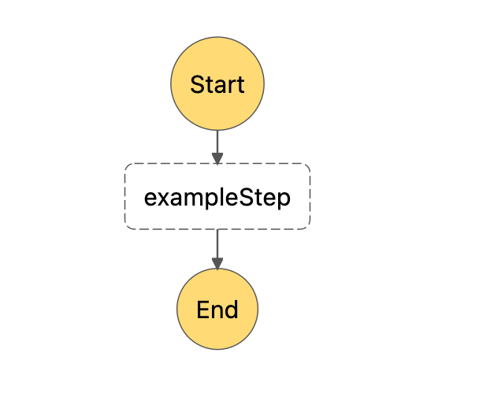

# Task 1 - Start the workflow

## Where do we start?
Checkout onto branch `task/1` unless already there:
        
        git checkout task/1

In the `serverless.yml` file there's an `inputBucket` defined in `serverless.yml`.

There's also a `scan-file` lambda function registered:
* see `functions/scan-file/function.yml` 
* see how it subscribes to a `ObjectCreated` event from S3.

This means that the lambda function gets fired every time a file is uploaded into the S3 bucket.

Try yourself what the lambda's input arguments are when it gets invoked this way:
1. Add a log entry in `functions/scan-file/handler.ts` to log `event` argument of the `handler` method.
2. Deploy the Serverless stack: `npx sls deploy --aws-profile=tsh-workshops`.
3. In the [AWS S3 Console](https://s3.console.aws.amazon.com/s3/buckets?region=eu-west-1) choose the `inputBucket` which contains your username (eg. `tsh-academy-serverless-workshops-input-bucket-student00` and upload any file from your computer (`"Upload"` -> `"Add files"` -> `"Upload"` button).
4. In [CloudWatch logs](https://eu-west-1.console.aws.amazon.com/cloudwatch), see the logged output.

On top of that, `serverless.yml` also declares a step function workflow, named `ScanCvWorkflow`. Its definition is held in another file, `workflows/scan-cv-workflow/workflow.asl.yml` . There's only one step in it, which invokes an example Lambda function.

* See how the Lambda function is referenced by its name, as it's defined in `workflows/scan-cv-workflow/example-lambda/function.yml`. 
* See how [`GetAtt`](https://docs.aws.amazon.com/AWSCloudFormation/latest/UserGuide/intrinsic-function-reference-getatt.html) Cloud Formation function is called to access the Lambda's [ARN](https://docs.aws.amazon.com/general/latest/gr/aws-arns-and-namespaces.html) and provide it to the step definition.
* Note that "Start" and "End" are not states per se, and you don't define them in the `workflow.asl.yml` file.
* You can try out the workflow manually by clicking `Start execution` in the [AWS Step Functions Console](https://eu-west-1.console.aws.amazon.com/states/home?region=eu-west-1#/statemachines).

## Description
What we want to achieve is that the workflow starts automatically as soon as a resume file is uploaded to the input S3 bucket.

We need you to add logic to `scan-file` lambda which will start the workflow execution:

1. Open `functions/scan-file/handler.ts` .
2. Create a new StepFunctions client, preferably outside the `handle()` method,

        const sf = new StepFunctions(); 

3. In the `handle` method, invoke the `ScanCvWorkflow` step function, using the client's [`startExecution`](https://docs.aws.amazon.com/step-functions/latest/apireference/API_StartExecution.html) method:

        sf.startExecution({...});

* as the execution's `input`, pass the uploaded file's path
* `name` should be a unique identifier for each execution - you might use the filename followed by a uuid
* `stateMachineArn` has already been provided as an env variablee - see the `config` object
* by the way, SDK methods have the utility method `.promise()` for use with async/await :)

4.  Redeploy the stack by running:
   
        npx sls deploy --aws-profile=tsh-workshops

## Result
You may now upload one of the test files (see: `./test-data`) into your input AWS bucket with the [S3 Console](https://s3.console.aws.amazon.com/s3/home?region=eu-west-1). 

Once you've uploaded a file, you should see:
1. A workflow started in the [Step Functions console](https://eu-west-1.console.aws.amazon.com/states/home?region=eu-west-1#/statemachines)
2. Log entries from the `scan-file` lambda in [Cloud Watch console](https://eu-west-1.console.aws.amazon.com/cloudwatch/home?region=eu-west-1#) (You need to find a `LogGroup` containing your username.)

### Useful links
- [StartExecution method in AWS SDK](https://docs.aws.amazon.com/step-functions/latest/apireference/API_StartExecution.html)
- [How to invoke Step Functions](https://docs.aws.amazon.com/step-functions/latest/dg/concepts-invoke-sfn.html)
- [Cloud Formation intrinsic functions: GetAtt](https://docs.aws.amazon.com/AWSCloudFormation/latest/UserGuide/intrinsic-function-reference-getatt.html)
- [What is ARN in AWS?](https://docs.aws.amazon.com/general/latest/gr/aws-arns-and-namespaces.html)
  