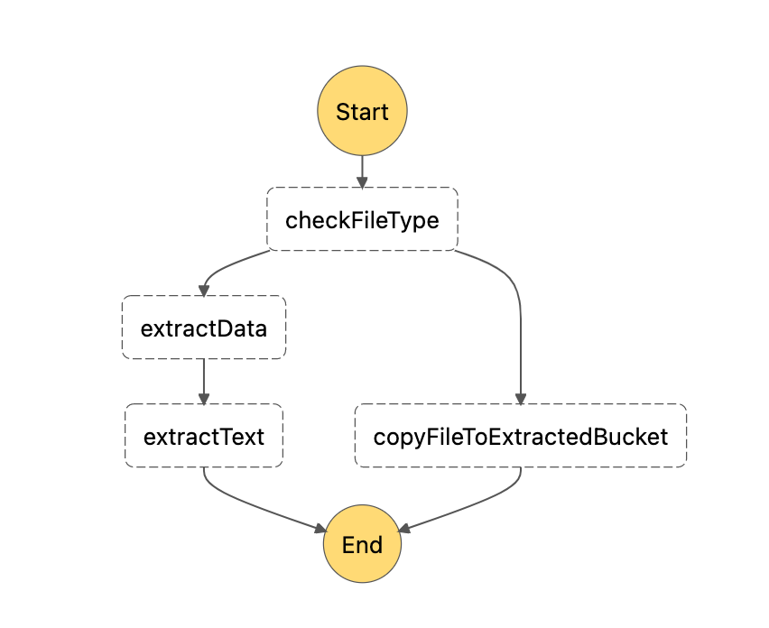

# Task 3 - Parallel processing

## Where do we start?
In the previous task we established how we are going to extract data from a resume file.

## Description
In this exercise you are asked to create two Lambda functions responsible for searching experience in specific areas.
Implement following functions:
- check exclude list
- check node experience

The other two are already implemented (`check-it-experience` and `check-cloud-experience`). You may use them as a guide.

1. Add parallel step `checkExperience` in `workflow.asl.yml` file.
2. Create following lambda functions
   1. `check-node-experience`
   3. `check-exclude-list`
3. Register following lambda functions in `serverless.yml`
   1. `check-node-experience`
   3. `check-cloud-experience`
   4. `check-it-experience`
   2. `check-exclude-list`
4. Make sure that all lambdas from this task are referenced in a parallel step in `workflow.asl.yml`.
5. Add necessary log entries and verify if workflow succeeds on test files.

## Result
You have built a parallel processing with multiple Lambda functions for
calculating score in different technologies.

## Graph

### Useful links
- [Calculating score](../workflows/scan-cv-workflow/utils.ts)
- [Parallel steps in Step Functions](https://docs.aws.amazon.com/step-functions/latest/dg/amazon-states-language-parallel-state.html)
