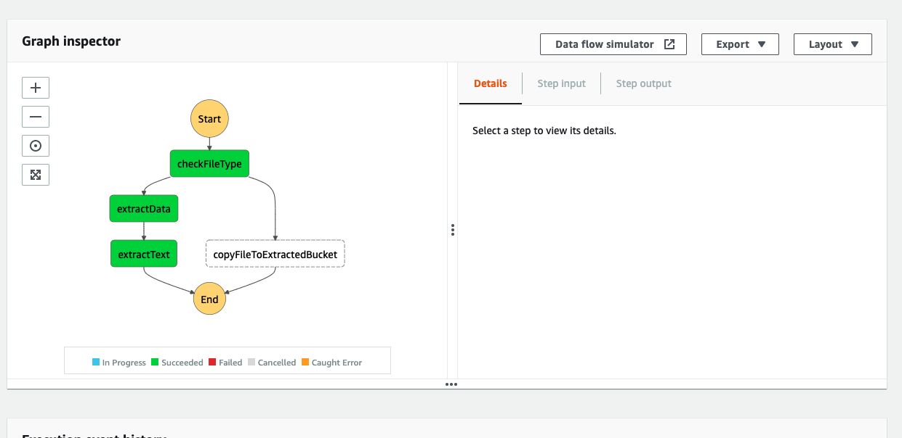
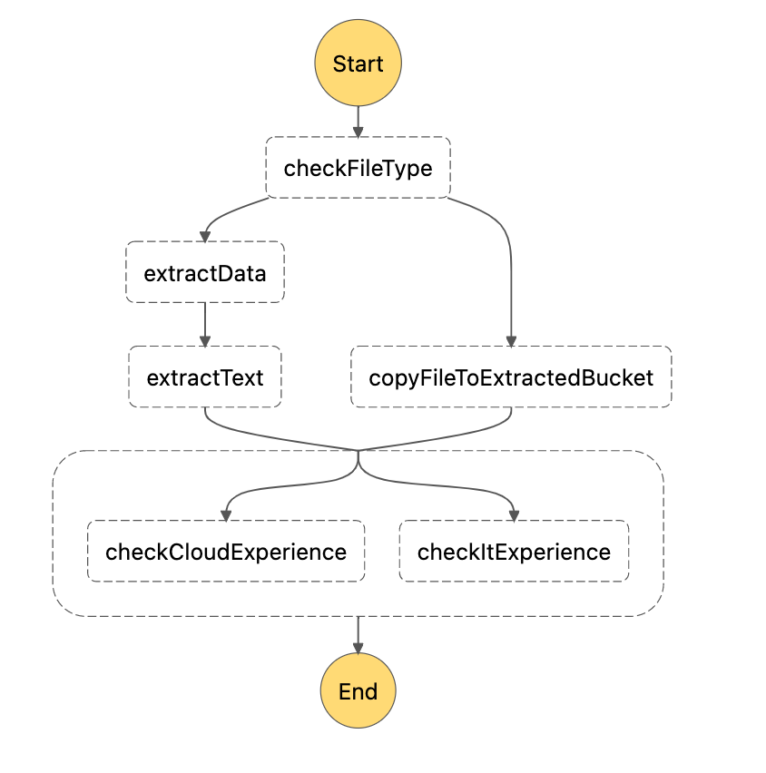

# Task 3 - Parallel processing

## Where do we start?
In the previous task we established how we are going to extract data from a resume file.



## Description
In this exercise we're going to scan the extracted text and screen the candidates' experience.

Two Lambda functions have been prepared for you, which analyse the contents of the resume file and calculate a score based on occurence of certain keywords in the input text:

* `check-it-experience` 
* `check-cloud-experience`). 

Your task will be to attach the Lambda functions to the existing workflow and run them in paralell.

1. Add a parallel step `checkExperience` in `workflow.asl.yml` file.
2. Attach the two lambdas to two branches of the paralell step.
3. Verify if the workflow succeeds on test files.
4. Did something wrong happen when running the workflow? How do you think, what's the issue? How can it be fixed?

Example Yaml configuration of a parallel step:
```
exampleParallelStep:
    Type: Parallel
    End: true
    Branches:
      - StartAt: firstOfStepsUsingLambda
        States:
          firstOfStepsUsingLambda:
            Type: Task
            Resource: arnOfFirstOfStepsUsingLambda
            End: true
      - StartAt: secondOfStepsUsingLambda
        States:
          secondOfStepsUsingLambda:
            Type: Task
            Resource: arnOfSecondOfStepsUsingLambda
            End: true
```

## Result
You have built a parallel processing with two Lambda functions for
calculating score in different technologies.

## Graph


### Useful links
- [Parallel steps in Step Functions](https://docs.aws.amazon.com/step-functions/latest/dg/amazon-states-language-parallel-state.html)
