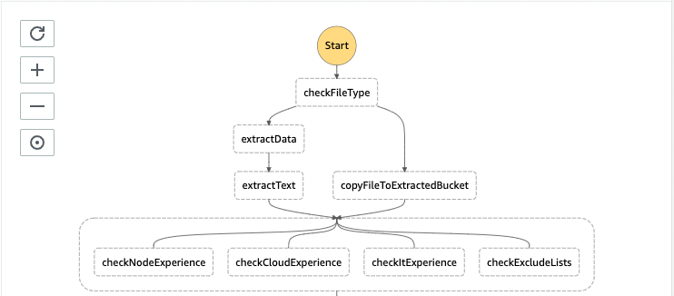

# Task 4 - Calculate score

## Where do we start?
In the previous task we checked candidate experience in multiple fields by parallel processing of resume data.



## Description
In this exercise you are asked to calculate the total score of the resume based on the previously extracted experience scores.

1. Add a new step `calculateScore`, after the `checkExperience` step you added in the previous task.
   1. Make it a `Task` type, running a lambda called `calculateScore` which has already been created for you (see `workflows/scan-cv-workflow/calculate-score/function.yml`).
   2. Make sure that `checkExperience` transitions to `calculateScore` instead of being a terminal state.
2. Implement the calculation logic in `workflows/scan-cv-workflow/calculate-score/handler.ts`.
   1. Let the lambda return data matching the below pattern and define it as a new interface `ScanCvScoreEvent`, in 
   `workflows/scan-cv-workflow/types.ts`.
   2. Calculate the total score, given the `singleEvent` object. The score should:
      1. Be equal to `0` if the candidate has been excluded by check-exclude-list lambda,
      2. Be a sum of the other scores otherwise.

**Pattern:**
```typescript
{
  calculatedScore: number;
}
```

## Result
You have tested the workflow with test files and the final step output returns total score.

## Graph

