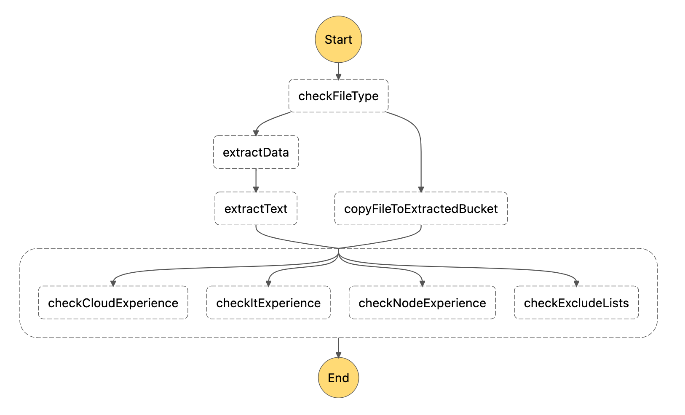
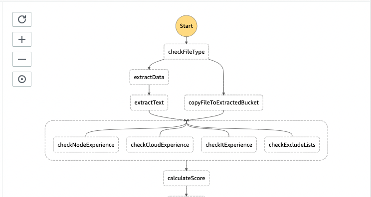

# Task 4 - Calculate score

## Where do we start?
In the previous task we checked candidate experience in multiple fields by parallel processing of resume data.



## Description
In this exercise you are asked to calculate total score of resume based on previously extracted experience scores.

1. Make sure the returned value from Lambda is of the type ScanCvScoreEvent defined in
   workflows/scan-cv-workflow/types.ts
2. Calculate the total score, given the singleEvent object. The score should:
   1. Equal to 0 if the candidate has been excluded by check-exclude-lists lambda
   2. Be a sum of the other scores otherwise

**Pattern:**
```typescript
{
  key: string;
  extension: string;
  calculatedScore: number;
  copySource: string;
}
```

## Result
You have tested workflow with test files and final step output returns total score.

## Graph

