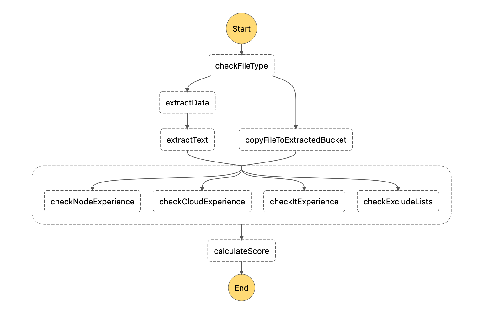

# Task 5 - Native Integrations

## Where do we start?
In the previous task we have checked calculated total score of candidate resume.



## Description
In this exercise you are asked to store resume in different S3 buckets. One for accepted and one for rejected resumes.

1. Add S3 bucket definition for `matchedFilesBucket` in `serverless.yml` file (use e.g. inputBucket as an example).
2. Add S3 bucket definition for `rejectedFilesBucket` in `serverless.yml` file (use e.g. inputBucket as an example).
3. Add new step `checkScore` in `workflow.asl.yml` file.
   1. It should be `Choice` step.
   2. It should save file to `matchedFilesBucket` when calculated score is greater than 100.
   3. By default, it should save file to `rejectedFilesBucket`.
4. Make sure steps uploading file have `End: True` to finalise workflow execution.
5. Add ENV variable with `matchedBucket` name the `calculateScore` Lambda. It should be added in `function.yml`.
6. Add ENV variable with `rejectedBucket` name the `calculateScore` Lambda. It should be added in `function.yml`.
7. Fill `matchedFilesBucketName` and `rejectedFilesBucketName` in `calculateScore` Lambda.


**Variables to be added in calculate score lambda definition**
```dotenv
S3_MATCHED_FILES_BUCKET_NAME: tsh-academy-serverless-workshops-matched-files-${env:STUDENT_NAME, 'student01'}
S3_REJECTED_FILES_BUCKET_NAME: tsh-academy-serverless-workshops-rejected-files-${env:STUDENT_NAME, 'student01'}
```

## Result
You have successfully deployed 2 additional S3 buckets. Your workflow uploads resume into correct buckets based on the
score.

## Graph


### Useful links
- [Choice step](https://docs.aws.amazon.com/step-functions/latest/dg/amazon-states-language-choice-state.html)
- [Native integration with AWS API](https://docs.aws.amazon.com/step-functions/latest/dg/supported-services-awssdk.html)
- [ENV variables](https://www.serverless.com/framework/docs/providers/aws/guide/variables#referencing-environment-variables)
