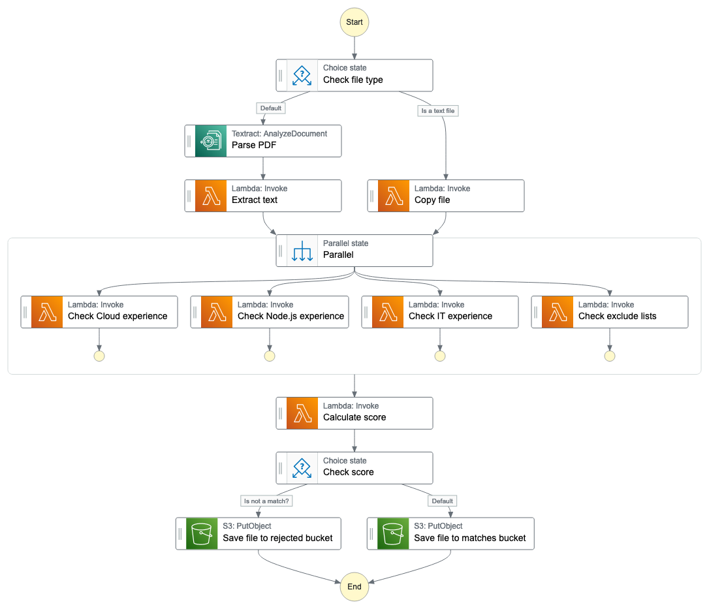

# TASK 2

## Description
Look at the graph and fill workflow with missing steps for data extraction:

1. Extract Text
2. Copy file
3. Check file type

The lambda implementations already exists.

## Graph

 

### Useful links
- [StepFunctions documentation](https://docs.aws.amazon.com/step-functions/latest/apireference/API_StartExecution.html)